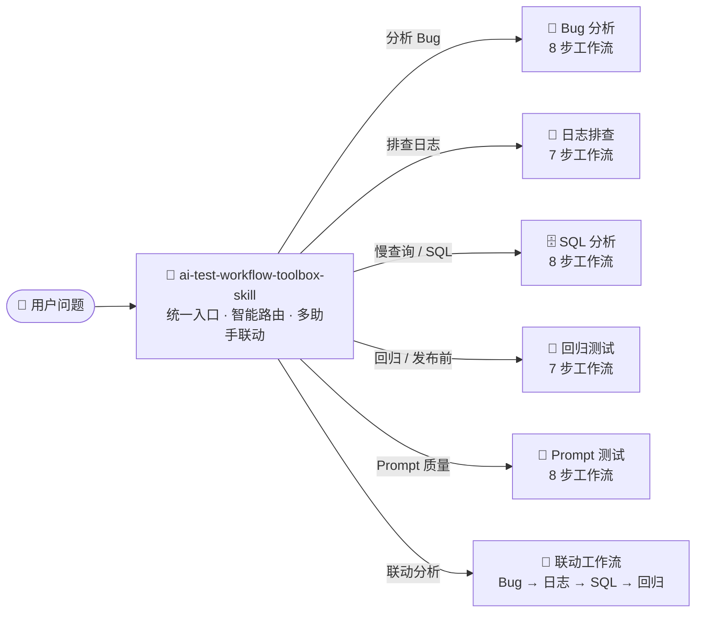

<div align="center">

# 🧪 AI 测试工作流技能包

**一套面向 AI 辅助软件测试的 Claude Code 技能集合**

<p align="center">
  
  
  
  
</p>

`6 个技能` · `统一工作流` · `标准化输出` · `多助手联动`

</div>

---

## ✨ 项目简介

这不是一堆零散的 Prompt 模板，而是一套**体系化、可联动、可积累**的 AI 辅助测试工具集：

- 🧭 **统一入口** —— 工具箱自动识别意图，智能路由到对应技能
- 📋 **标准化流程** —— 每个技能固定 7–8 步，不跳步、不猜测、不编造
- 📤 **结构化输出** —— 可复现、可交接、可评审的统一报告格式
- 🛡️ **防幻觉约束** —— 证据不足时先追问，而非断言根因
- ✅ **人工复核** —— AI 产出 + 人工把关的协作模式
- 📦 **知识积累** —— 历史 Bug、日志规律、SQL 风险模式持续沉淀

---

## 🗺️ 架构总览



> 5 个专项技能既可独立使用，也可通过工具箱联动串联。

---

## 🧭 技能清单

| 技能 | 定位 | 规模 |
|------|------|:----:|
| [🧭 统一工具箱](ai-test-workflow-toolbox-skill/SKILL.md) | 统一入口 · 智能路由 · 多助手联动 | 112 文件 |
| [🐛 Bug 分析](bug-analysis-skill/SKILL.md) | 8 步结构化 Bug 分析 | 11 文件 |
| [📝 日志排查](log-analysis-skill/SKILL.md) | 7 步日志异常根因收敛 | 17 文件 |
| [🗄️ SQL 分析](sql-analysis-skill/SKILL.md) | 8 步 SQL 性能风险识别 | 20 文件 |
| [🔄 回归测试](regression-test-skill/SKILL.md) | 7 步精准回归范围分析 | 16 文件 |
| [🤖 Prompt 测试](prompt-test-skill/SKILL.md) | 8 步 Prompt 质量工程化验证 | 28 文件 |

<details>
<summary><b>🧭 统一工具箱</b> —— 一技能打通所有测试场景</summary>

> 入口级技能：根据用户意图自动分发到对应工作流，统一 P0–P3 风险等级与人工复核规则。

**路由规则**

| 用户意图 | 路由到 |
|----------|--------|
| 分析 Bug | Bug 分析工作流 |
| 排查日志 | 日志排查工作流 |
| 慢查询 / SQL | SQL 分析工作流 |
| 回归 / 发布前 | 回归测试工作流 |
| Prompt 质量 | Prompt 测试工作流 |
| 联动分析 | Bug → 日志 → SQL → 回归 四步串联 |

**内置资产**

- 📦 5 类资产库：历史 Bug、日志规律、SQL 风险、回归规则、Prompt 测试案例
- 📚 5 类参考知识库，按技能维度组织（31 文件）
- 🧩 6 个工作流 + 7 个 Prompt + 5 种输出格式规范

</details>

<details>
<summary><b>🐛 Bug 分析</b> —— 输出可复现的结构化排查报告</summary>

```
校验输入 → 问题现象 → 影响模块 → 日志方向 → SQL 方向 → 历史 Bug → 回归范围 → 风险等级 → 人工复核
```

| 亮点 | 说明 |
|------|------|
| 📥 输入不完整先追问 | 对照 `bug-input-template.md`，缺项列出待补充问题 |
| 🔗 历史 Bug 关联 | 匹配历史 Bug 库，标注相似度，避免重复排查 |
| 🎯 回归范围三级 | 必测 / 建议测 / 抽测，不写「相关功能」等模糊表述 |
| 🚫 禁止无据断言 | 无日志 / 无数据时不允许猜测根因 |

**输出：** 10 章节结构化 Bug 分析报告（输入摘要 → 人工复核清单）

</details>

<details>
<summary><b>📝 日志排查</b> —— 从杂乱日志中收敛异常根因方向</summary>

```
关键词提取 → 异常类型归类 → 调用链还原 → 模块定位 → 历史模式匹配 → 风险等级 → 缺失信息清单
```

| 亮点 | 说明 |
|------|------|
| 🏷️ 异常类型自动归类 | `exception_type_map.md` 区分 timeout、duplicate key、connection refused 等 |
| 🔗 服务调用链还原 | 按 traceId 还原分布式调用路径，定位首次异常点 |
| 📊 历史模式匹配 | `log_pattern_history.md` 积累的常见错误模式快速匹配 |
| ⚠️ 证据不足输清单 | 信号不足时输出「缺失信息清单」，而非硬猜根因 |

**内置：** 7 种仿真日志样例（支付锁超时、重复键、连接拒绝、MQ 消费异常等）

</details>

<details>
<summary><b>🗄️ SQL 分析</b> —— 告别「慢就加索引」的粗暴做法</summary>

```
输入校验 → SQL 结构 → 索引使用 → 数据量评估 → 执行计划 → 风险信号 → 优化建议 → 验证方式
```

| 亮点 | 说明 |
|------|------|
| 📐 强制输入契约 | 必须提供 DDL + 数据量 + EXPLAIN，缺一则列待补充项 |
| 🚨 8 种高危信号 | 全表扫描、深分页、隐式转换、函数包裹索引、低基数索引等 |
| 📝 优化建议带验证 | 每条建议附验证方式，如「加上索引后 EXPLAIN 应显示 Using index」 |
| 📋 事故模式库 | `sql_incident_patterns.md` 记录历史 SQL 事故，辅助模式匹配 |

**内置：** 5 个典型 SQL 场景 + EXPLAIN 结果样例 + 完整报告对照

</details>

<details>
<summary><b>🔄 回归测试</b> —— 回答「这次发布到底要测什么」</summary>

```
解析改动 → 识别上下游影响 → 业务链路补全 → 关联历史 Bug → 标记风险等级 → 输出清单 → 人工复核
```

| 亮点 | 说明 |
|------|------|
| 🗺️ 模块影响映射 | `module-impact-map.md` 定义模块间上下游依赖关系 |
| 🔗 业务链路知识 | 内置支付、订单两条完整业务链路（可扩展） |
| 📊 历史 Bug 驱动 | 自动匹配历史 Bug CSV，推荐高频故障场景回归 |
| 🎨 P0–P3 风险标记 | 每个回归项标注风险等级 + 触发原因，不是「全测一遍」 |

**输出：** 可执行回归清单（含风险等级、触发原因、历史 Bug 关联、建议优先级）

</details>

<details>
<summary><b>🤖 Prompt 测试</b> —— 5 维度工程化质量验证</summary>

```
明确目标 → 正常样本 → 稳定性×3 → 边界输入 → 错误输入 → 多轮一致性 → 幻觉风险 → 测试报告
```

| 维度 | 验证什么 | 不合格信号 |
|------|----------|------------|
| 🔁 稳定性 | 同输入 × 3 次，核心字段不漂移 | 有时有边界值，有时没有 |
| 🔲 边界输入 | 信息过少 / 过多时仍清晰 | 需求极短却乱编完整方案 |
| ❌ 错误输入 | 识别矛盾，先质疑再生成 | 顺着错误需求硬写 |
| 🔄 多轮一致 | 后续轮次遵守前面规则 | 第二轮忘掉输出格式 |
| 🌀 幻觉风险 | 证据不足时克制下结论 | 日志一行就断定根因 |

**内置：** 7 个测试样本（01–07 号）· 稳定性 ≥ 3 次 · 不通过输出 v2 修改版

</details>

---

## 🚀 快速开始

### 方式一：单独使用某个技能

在 Claude Code 中，通过 `@目录/SKILL.md` 引用对应技能：

```text
# Bug 分析
@bug-analysis-skill/SKILL.md
订单支付成功但状态显示未支付，请帮我分析。

# 日志排查
@log-analysis-skill/SKILL.md
这是报错日志片段：[粘贴日志]，请排查。

# SQL 分析
@sql-analysis-skill/SKILL.md
这条 SQL 执行超过 3 秒：[SQL]，这是我的表结构和 EXPLAIN。

# 回归测试
@regression-test-skill/SKILL.md
支付回调模块有更新，请生成回归测试清单。

# Prompt 测试
@prompt-test-skill/SKILL.md
这是我的 Prompt：[Prompt 内容]，请执行完整测试。
```

### 方式二：使用统一工具箱

```text
@ai-test-workflow-toolbox-skill/SKILL.md
Bug、日志、SQL 联动分析：[描述你的问题]
```

### 方式三：联动模式

工具箱会根据问题复杂度自动路由到联动工作流，按 **Bug → 日志 → SQL → 回归** 的顺序逐步执行。

---

## 📂 目录结构

```text
claude-skills-portfolio/
├── README.md                              # 项目说明
│
├── ai-test-workflow-toolbox-skill/        # 🧭 统一工具箱（112 文件）
│   ├── SKILL.md                           # 总入口 + 路由表
│   ├── workflows/                         # 6 个工作流定义
│   ├── prompts/                           # 5 个助手 Prompt + 2 个待测 Prompt
│   ├── references/                        # 5 类参考知识库（31 文件）
│   ├── outputs/                           # 5 种输出格式规范
│   ├── system/                            # 3 个统一规则
│   ├── assets/                            # 5 类资产库 + 样例（22 文件）
│   ├── examples/                          # 实战案例（24 文件）
│   ├── templates/                         # 输入模板
│   ├── records/                           # 运行记录模板
│   ├── reports/                           # 报告模板
│   └── scripts/                           # 验证脚本
│
├── bug-analysis-skill/                    # 🐛 Bug 分析（11 文件）
├── log-analysis-skill/                    # 📝 日志排查（17 文件）
├── sql-analysis-skill/                    # 🗄️ SQL 分析（20 文件）
├── regression-test-skill/                 # 🔄 回归测试（16 文件）
└── prompt-test-skill/                     # 🤖 Prompt 测试（28 文件）
```

---

## 💡 设计理念

### 🎯 不是 Prompt，而是 Workflow

每个技能不是「万能 Prompt」，而是**固定步骤的工作流**（7–8 步），步骤先后经过设计，确保分析不遗漏、不跳步。

### 🛡️ 默认不信任 AI 的结论

内置大量防幻觉约束：缺少输入先追问、证据不足输出缺失信息清单、每个输出附带人工复核 Checklist、Bug 报告禁止出现「可能是 / 应该是」。

### 📈 可积累的领域知识

`references/` 和 `assets/` 下的知识库是**活的**——历史 Bug、日志模式、SQL 事故、业务链路都可以持续补充。

### 🔗 独立可用，组合更强

类比 Unix 哲学：每个工具做好一件事，通过工具箱管道组合释放更大价值。

---

## 📊 质量维度覆盖

| 维度 | 🐛 Bug | 📝 日志 | 🗄️ SQL | 🔄 回归 | 🤖 Prompt |
|------|:---:|:---:|:---:|:---:|:---:|
| 输入校验 | ✅ | ✅ | ✅ | ✅ | ✅ |
| 风险等级 (P0–P3) | ✅ | ✅ | ✅ | ✅ | — |
| 历史数据关联 | ✅ | ✅ | ✅ | ✅ | — |
| 人工复核 | ✅ | ✅ | ✅ | ✅ | ✅ |
| 缺失信息清单 | ✅ | ✅ | ✅ | ✅ | — |
| 禁止猜测 | ✅ | ✅ | ✅ | ✅ | — |
| 输出格式规范 | ✅ | ✅ | ✅ | ✅ | ✅ |
| 稳定性测试 | — | — | — | — | ✅ |
| 幻觉测试 | — | — | — | — | ✅ |

---

## 🤝 适用场景

- 🧑‍💻 **测试工程师** —— Bug 分析、回归范围生成、SQL / 日志排查
- 👩‍🔬 **QA Leader** —— Prompt 质量验证、测试流程标准化
- 🏗️ **开发团队** —— 代码改动后的影响分析、发布前回归清单
- 📚 **技能学习** —— AI 辅助测试工作流入门参考

---

## 📝 License

MIT © 2025

---

<p align="center">
  <sub>Built with ❤️ for the Claude Code community</sub>
</p>